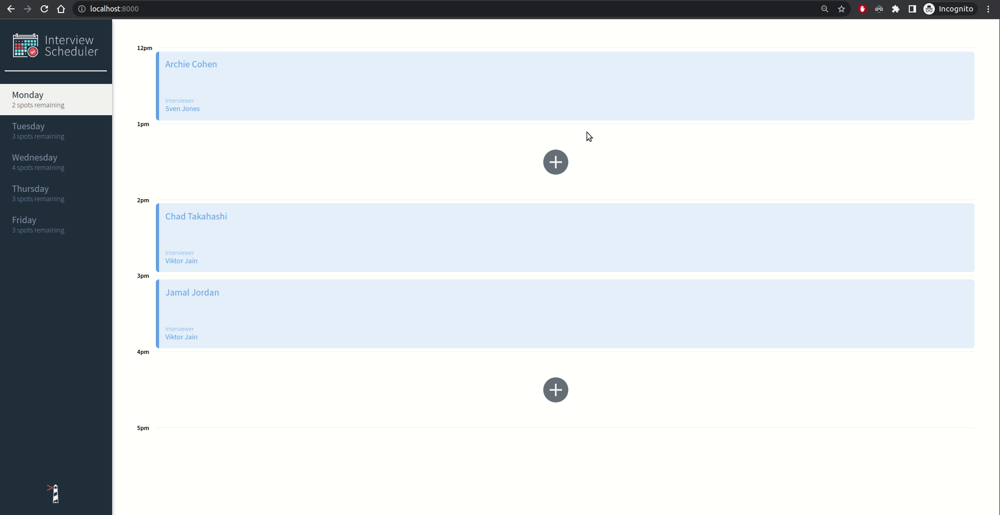
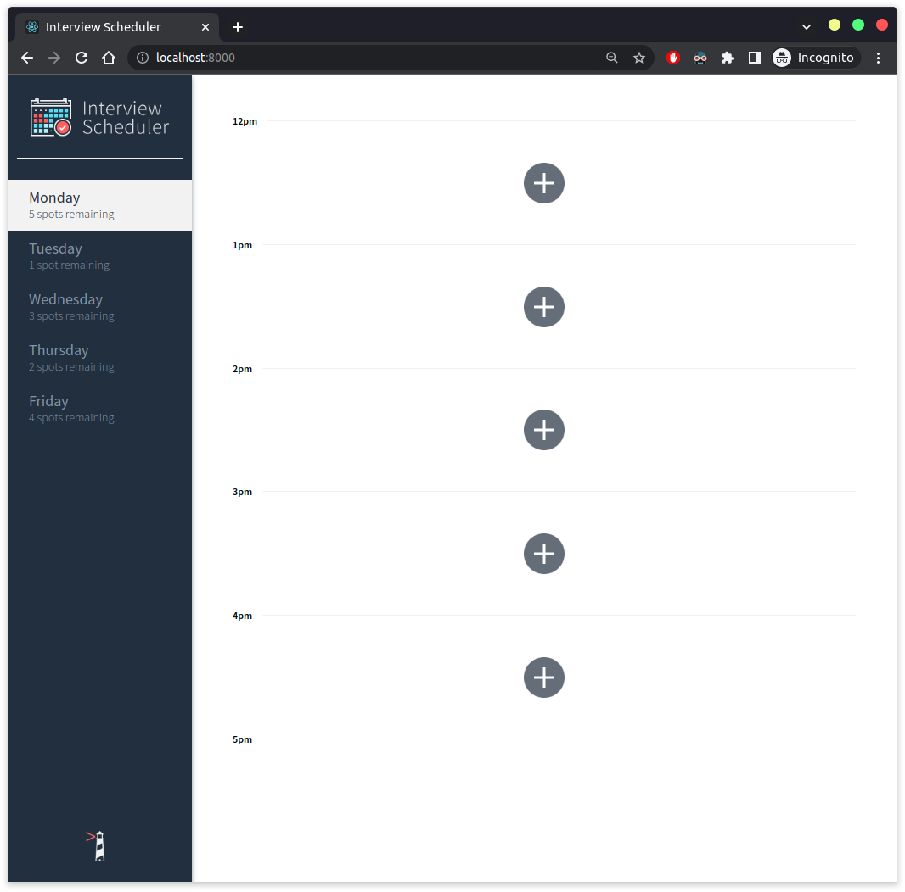
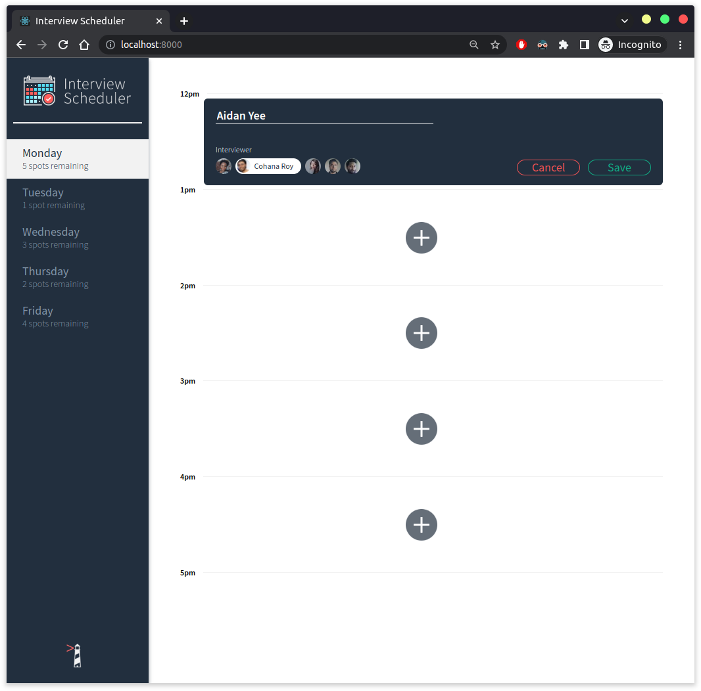
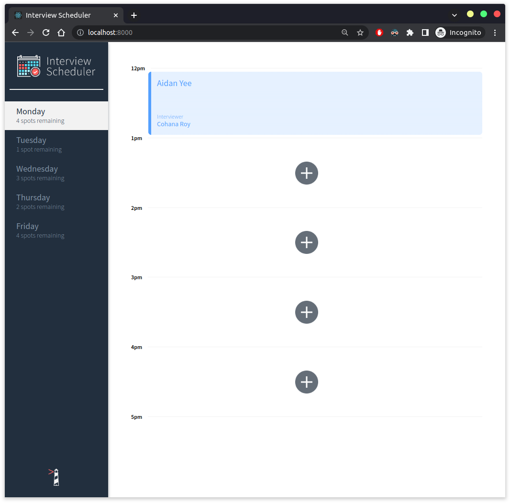

# Interview Scheduler

An interview scheduler app project where users are able to book an interview with an interviewer. Can book, edit, delete an interview as well. The "spots" remaining will be updated based on if a user adds/deletes an interview.

## Screenshots









## Setup

Install dependencies with `npm install`.

## Running Webpack Development Server

```sh
npm start
```

## Running Jest Test Framework

```sh
npm test
```

## Running Storybook Visual Testbed

```sh
npm run storybook
```

## Running Cypress Test Framework

```sh
npm run cypress
```

## Dependencies

- Node.js v12.22.5
- React.js
- Axios
- Storybook
- Jest
- Cypress
